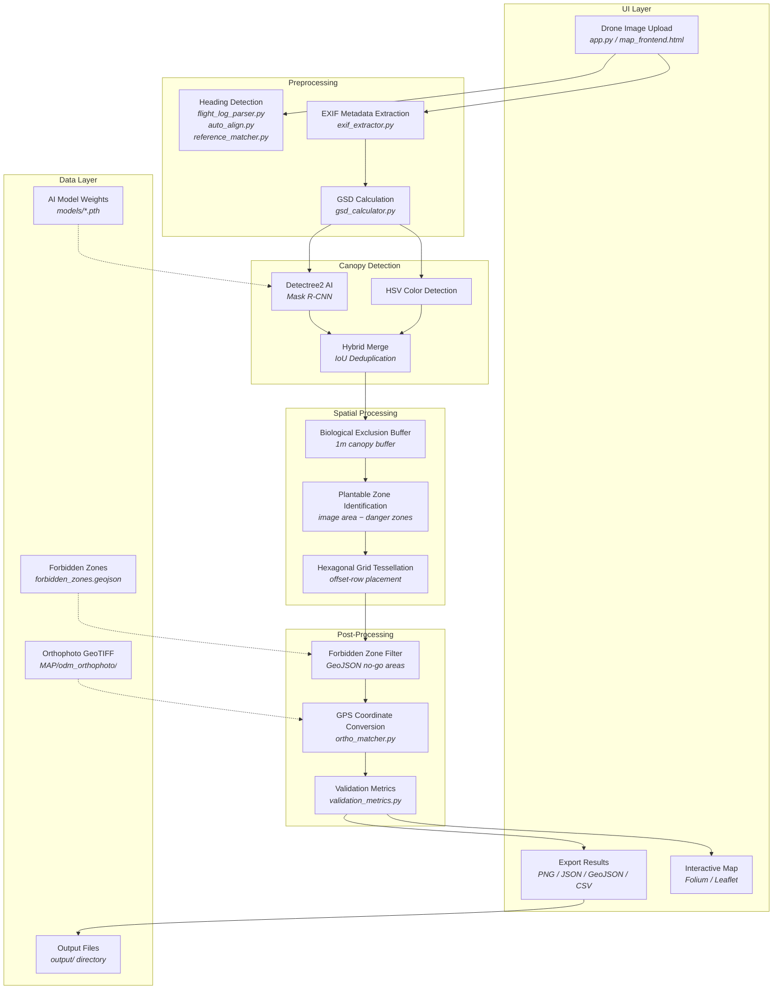

# MangroVision — Software Architecture

This document describes the actual software architecture of MangroVision as implemented in the codebase, and compares it against the proposed architecture diagram.

---

## Architecture Diagram Accuracy Assessment

The proposed architecture diagram identifies three layers (UI, Backend Logic, Data Access) with the following components. Here is how each maps to the actual implementation:

### UI Layer

| Diagram Component | Accuracy | Actual Implementation |
|---|---|---|
| Drone Imagery Upload | ✅ Accurate | `app.py` — Streamlit file upload widget; `map_frontend.html` — drag-and-drop upload zone |
| GIS Interface | ✅ Accurate | `map_frontend.html` — Leaflet map with XYZ orthophoto tiles; `app.py` — Folium maps with OpenStreetMap base layers |
| Interactive Map Visualization | ✅ Accurate | `app.py` — Folium-based interactive maps with green/red markers, popups, and layer controls; `map_frontend.html` — Leaflet markers with custom icons |
| Review Reforestation Plan | ⚠️ Partial | Results are displayed inline (canopy count, danger area, plantable area, hexagon count) with download buttons for PNG/JSON/GeoJSON/CSV — but there is no dedicated "Review Reforestation Plan" page or workflow step |

### Backend Logic Layer

| Diagram Component | Accuracy | Actual Implementation |
|---|---|---|
| EXIF Metadata Extraction | ✅ Accurate | `canopy_detection/exif_extractor.py` — `ExifExtractor` class extracts GPS coordinates, altitude, camera info, and heading from drone EXIF data |
| Mangrove Canopy Detection | ✅ Accurate | `canopy_detection/canopy_detector_hexagon.py` — `HexagonDetector` class with three modes: Hybrid (HSV + AI merge), AI-only (detectree2 Mask R-CNN), and HSV-only (color-based) |
| Geospatial Processing Engine | ✅ Accurate | `canopy_detection/ortho_matcher.py` — homography-based GPS alignment; `canopy_detection/gsd_calculator.py` — ground sample distance calculation; pyproj coordinate transformations (UTM Zone 51N ↔ WGS84) |
| Biological Exclusion Buffer | ✅ Accurate | `canopy_detection/canopy_detector_hexagon.py` — `create_danger_zones()` creates 1m buffer around detected canopies; `canopy_detection/forbidden_zone_filter.py` — `ForbiddenZoneFilter` removes planting locations within GeoJSON-defined no-go zones (bridges, roads, buildings) |
| Hexagonal Grid Tessellation | ✅ Accurate | `canopy_detection/canopy_detector_hexagon.py` — `generate_hexagonal_planting_zones()` fills plantable areas with hexagonal grid cells using offset-row spacing and strict clearance checks |

### Data Access Layer

| Diagram Component | Accuracy | Actual Implementation |
|---|---|---|
| Output and Export Module | ⚠️ Inline | Export functionality is embedded directly in `app.py` as Streamlit download buttons (PNG visualization, JSON statistics, GeoJSON tree crowns, CSV summary). There is no separate export module. |
| Result Processing Module | ⚠️ Inline | Result aggregation and formatting happens inline within `app.py` and `map_backend.py` endpoints. There is no separate result processing module. |
| SQLite Database | ❌ **Does not exist** | The codebase does **not** use SQLite or any database. All results are returned as in-memory JSON via FastAPI responses or saved as flat files (JSON, GeoJSON, CSV, PNG) to the `output/` directory. |

### Components Missing from the Diagram

The following modules exist in the codebase but are not represented in the diagram:

| Actual Component | Source File | Purpose |
|---|---|---|
| Flight Log Parser | `canopy_detection/flight_log_parser.py` | Extracts camera heading/yaw from DJI `.SRT` subtitle files |
| Auto-Alignment | `canopy_detection/auto_align.py` | Auto-detects camera heading via SIFT/ORB feature matching against orthophoto tiles |
| Reference Point Matcher | `canopy_detection/reference_matcher.py` | Calculates rotation angle from user-matched landmark points |
| Orthophoto Matcher | `canopy_detection/ortho_matcher.py` | Matches drone images to WebODM GeoTIFF orthophotos via homography for pixel→GPS conversion |
| Detectree2 AI Detector | `canopy_detection/detectree2_detector.py` | Wrapper around detectree2 (Mask R-CNN) for AI-based tree crown instance segmentation |
| Validation Metrics | `canopy_detection/validation_metrics.py` | Validates detection quality (crown sizes, commission/omission error rates, density analysis) |
| GSD Calculator | `canopy_detection/gsd_calculator.py` | Calculates ground sample distance from altitude, sensor specs, and focal length |
| Configuration | `canopy_detection/config.py` | Centralizes paths, detection parameters, drone settings, CRS, and output options |
| FastAPI Backend | `map_backend.py` | REST API serving map metadata and detection endpoints for the Leaflet-based frontend |
| SAMGeo Ortho Detector | `canopy_detection/samgeo_ortho_detector.py` | Processes high-resolution GeoTIFF orthophotos with tiled detectree2 detection |

---

## Actual Software Architecture

```
┌─────────────────────────────────────────────────────────────────────────────────────┐
│  UI Layer                                                                           │
│                                                                                     │
│  ┌──────────────────┐    ┌──────────────────┐    ┌────────────────────────────────┐  │
│  │  Streamlit App   │    │  FastAPI Backend  │    │  Leaflet Web Map               │  │
│  │  (app.py)        │    │  (map_backend.py) │◄──►│  (map_frontend.html)           │  │
│  │                  │    │                  │    │                                │  │
│  │  • Image Upload  │    │  • /api/detect-  │    │  • Orthophoto Tile Display     │  │
│  │  • Mode Select   │    │    plantable-area│    │  • Drag-and-Drop Upload        │  │
│  │  • Settings      │    │  • /api/map/     │    │  • Marker Visualization        │  │
│  │  • Folium Maps   │    │    metadata      │    │  • Interactive Legend           │  │
│  │  • Results View  │    │                  │    │                                │  │
│  │  • Export (PNG/  │    └──────┬───────────┘    └────────────────────────────────┘  │
│  │    JSON/GeoJSON/ │           │                                                    │
│  │    CSV)          │           │                                                    │
│  └──────┬───────────┘           │                                                    │
│         │                       │                                                    │
├─────────┼───────────────────────┼────────────────────────────────────────────────────┤
│  Processing Pipeline            │                                                    │
│         │                       │                                                    │
│         ▼                       ▼                                                    │
│  ┌──────────────────┐    ┌──────────────────┐    ┌──────────────────┐                │
│  │  EXIF Metadata   │    │  Heading          │    │  GSD Calculator  │                │
│  │  Extraction      │    │  Detection        │    │  (gsd_calculator │                │
│  │  (exif_extractor │    │                  │    │   .py)           │                │
│  │   .py)           │    │  • Flight Log     │    │                  │                │
│  │                  │    │    Parser (.SRT)  │    │  • Altitude →    │                │
│  │  • GPS Coords    │    │  • Auto-Align     │    │    meters/pixel  │                │
│  │  • Altitude      │    │    (SIFT/ORB)    │    │  • Drone presets  │                │
│  │  • Camera Info   │    │  • Reference      │    │  • Coverage calc  │                │
│  │  • Drone Model   │    │    Matcher        │    │                  │                │
│  └──────┬───────────┘    │  • Manual Input   │    └──────┬───────────┘                │
│         │                └──────┬───────────┘           │                            │
│         │                       │                       │                            │
│         ▼                       ▼                       ▼                            │
│  ┌──────────────────────────────────────────────────────────────────────┐             │
│  │  Mangrove Canopy Detection  (canopy_detector_hexagon.py)            │             │
│  │                                                                     │             │
│  │  ┌─────────────┐   ┌─────────────────┐   ┌──────────────────────┐  │             │
│  │  │ HSV Color   │   │ Detectree2 AI   │   │ Hybrid Merge         │  │             │
│  │  │ Detection   │ + │ (Mask R-CNN)    │ → │ (IoU deduplication)  │  │             │
│  │  │             │   │ (detectree2_    │   │                      │  │             │
│  │  │             │   │  detector.py)   │   │                      │  │             │
│  │  └─────────────┘   └─────────────────┘   └──────────┬───────────┘  │             │
│  │                                                      │              │             │
│  │  ┌──────────────────────┐   ┌────────────────────────┴───────────┐  │             │
│  │  │ Non-Vegetation       │   │ Biological Exclusion Buffer        │  │             │
│  │  │ Detection            │   │ (1m canopy buffer via              │  │             │
│  │  │ (roads, water,       │   │  create_danger_zones)              │  │             │
│  │  │  buildings)          │   │                                    │  │             │
│  │  └──────────────────────┘   └────────────────────────┬───────────┘  │             │
│  │                                                      │              │             │
│  │  ┌──────────────────────────────────────────────────┐│              │             │
│  │  │ Plantable Zone Identification                    ││              │             │
│  │  │ (image area − danger zones)                      ││              │             │
│  │  └──────────────────────────────────────────────────┘│              │             │
│  │                                                      ▼              │             │
│  │  ┌──────────────────────────────────────────────────────────────┐   │             │
│  │  │ Hexagonal Grid Tessellation                                  │   │             │
│  │  │ (generate_hexagonal_planting_zones)                          │   │             │
│  │  │ • Offset-row hexagonal grid • 2.5m minimum clearance radius  │   │             │
│  │  │ • ≥80% core clearance check  • Overlap prevention            │   │             │
│  │  └──────────────────────────────┬───────────────────────────────┘   │             │
│  └─────────────────────────────────┼───────────────────────────────────┘             │
│                                    │                                                 │
│         ┌──────────────────────────┼──────────────────────────┐                      │
│         ▼                          ▼                          ▼                      │
│  ┌──────────────────┐    ┌──────────────────┐    ┌──────────────────┐                │
│  │  Forbidden Zone  │    │  Ortho Matcher   │    │  Validation      │                │
│  │  Filter          │    │  (ortho_matcher  │    │  Metrics         │                │
│  │  (forbidden_zone │    │   .py)           │    │  (validation_    │                │
│  │   _filter.py)    │    │                  │    │   metrics.py)    │                │
│  │                  │    │  • Pixel → GPS   │    │                  │                │
│  │  • GeoJSON zones │    │    via homography│    │  • Crown sizes   │                │
│  │  • Point-in-     │    │  • UTM ↔ WGS84  │    │  • Commission/   │                │
│  │    polygon check │    │  • GeoTIFF align │    │    omission rates│                │
│  └──────────────────┘    └──────────────────┘    └──────────────────┘                │
│                                                                                      │
├──────────────────────────────────────────────────────────────────────────────────────┤
│  Data & Configuration Layer                                                          │
│                                                                                      │
│  ┌──────────────────┐    ┌──────────────────┐    ┌──────────────────┐                │
│  │  Configuration   │    │  Forbidden Zones │    │  Output Files    │                │
│  │  (config.py)     │    │  (forbidden_     │    │  (output/)       │                │
│  │                  │    │   zones.geojson) │    │                  │                │
│  │  • Detection     │    │                  │    │  • *_zones.png   │                │
│  │    params        │    │  • 18 no-planting│    │  • *_results.json│                │
│  │  • Drone presets │    │    areas (bridges,│    │  • *.geojson     │                │
│  │  • CRS settings  │    │    roads, towers)│    │  • *.csv         │                │
│  │  • Output flags  │    │                  │    │                  │                │
│  └──────────────────┘    └──────────────────┘    └──────────────────┘                │
│                                                                                      │
│  ┌──────────────────┐    ┌──────────────────┐                                        │
│  │  Orthophoto      │    │  AI Models       │                                        │
│  │  GeoTIFF         │    │  (models/)       │                                        │
│  │  (MAP/odm_       │    │                  │                                        │
│  │   orthophoto/)   │    │  • detectree2    │                                        │
│  │                  │    │    .pth weights   │                                        │
│  └──────────────────┘    └──────────────────┘                                        │
│                                                                                      │
│  Note: No database is used. All persistence is file-based (JSON, GeoJSON, CSV, PNG). │
│                                                                                      │
└──────────────────────────────────────────────────────────────────────────────────────┘
```

---

## Processing Pipeline (Actual Data Flow)



---

## File-to-Component Mapping

| Source File | Diagram Component | Layer |
|---|---|---|
| `app.py` | Drone Imagery Upload, GIS Interface, Interactive Map Visualization, Results & Export | UI |
| `map_backend.py` | FastAPI REST API (map metadata, detection endpoint) | UI |
| `map_frontend.html` | Leaflet Web Map, Drag-and-Drop Upload | UI |
| `canopy_detection/exif_extractor.py` | EXIF Metadata Extraction | Preprocessing |
| `canopy_detection/flight_log_parser.py` | Heading Detection (DJI .SRT parsing) | Preprocessing |
| `canopy_detection/auto_align.py` | Heading Detection (SIFT/ORB feature matching) | Preprocessing |
| `canopy_detection/reference_matcher.py` | Heading Detection (landmark-based rotation) | Preprocessing |
| `canopy_detection/gsd_calculator.py` | Ground Sample Distance Calculation | Preprocessing |
| `canopy_detection/canopy_detector_hexagon.py` | Mangrove Canopy Detection, Biological Exclusion Buffer, Hexagonal Grid Tessellation | Core Detection |
| `canopy_detection/detectree2_detector.py` | Detectree2 AI Detection (Mask R-CNN wrapper) | Core Detection |
| `canopy_detection/forbidden_zone_filter.py` | Forbidden Zone Filter (GeoJSON-based) | Post-Processing |
| `canopy_detection/ortho_matcher.py` | Geospatial Processing / GPS Conversion | Post-Processing |
| `canopy_detection/validation_metrics.py` | Detection Quality Validation | Post-Processing |
| `canopy_detection/config.py` | Configuration (paths, params, CRS, presets) | Data & Config |
| `forbidden_zones.geojson` | Forbidden Zone Definitions (18 zones) | Data |
| `MAP/odm_orthophoto/` | WebODM Orthophoto GeoTIFF | Data |
| `models/` | Pre-trained AI Weights (detectree2) | Data |
| `output/` | Saved Results (PNG, JSON, GeoJSON, CSV) | Data |

---

## Key Differences from the Proposed Diagram

### 1. No SQLite Database

The diagram shows an SQLite database at the bottom of the Data Access Layer. **This does not exist in the codebase.** All persistence is file-based:
- Detection results → JSON files in `output/`
- Tree crown polygons → GeoJSON files in `output_geojson/`
- Visualizations → PNG files in `output/`
- Tabular exports → CSV downloads via Streamlit

### 2. Result Processing and Export Are Not Separate Modules

The diagram shows "Result Processing Module" and "Output and Export Module" as distinct components. In practice, result aggregation and export are handled inline within `app.py` (Streamlit download buttons) and `map_backend.py` (FastAPI JSON responses). There are no standalone modules for these functions.

### 3. Missing Components

The diagram omits several modules that are integral to the system:

- **Flight Log Parser** — Heading extraction from DJI `.SRT` files is essential for accurate GPS mapping
- **Auto-Alignment & Reference Matcher** — Two alternative methods for determining camera heading
- **Orthophoto Matcher** — Homography-based pixel-to-GPS conversion using WebODM GeoTIFFs
- **GSD Calculator** — Required for converting pixel measurements to real-world distances
- **Detectree2 AI Detector** — The AI detection backend is a separate wrapper module
- **Validation Metrics** — Quality checks for commission/omission errors
- **FastAPI Backend** — REST API layer that serves the Leaflet web map frontend
- **Configuration Module** — Centralized settings for detection parameters, CRS, and drone presets

### 4. Data Flow Corrections

**Diagram flow:** Drone Upload → GIS Interface → Interactive Map → Review Plan

**Actual flow:** Drone Upload → EXIF Extraction + Heading Detection → GSD Calculation → Canopy Detection (HSV/AI/Hybrid) → Buffer Creation → Plantable Zone → Hexagonal Grid → Forbidden Zone Filtering → GPS Conversion → Map Visualization + Export

The actual flow is a linear processing pipeline rather than a UI-navigation sequence. The GIS Interface and Interactive Map are output destinations, not intermediate processing steps.

### 5. Dual UI Architecture

The diagram shows a single UI layer. In reality, there are two independent user interfaces:

1. **Streamlit App** (`app.py`) — Full-featured analysis workflow with sidebar settings, detection mode selection, and inline map visualization using Folium
2. **Leaflet Web Map** (`map_frontend.html` + `map_backend.py`) — Standalone full-screen map interface with drag-and-drop upload, backed by FastAPI REST endpoints
