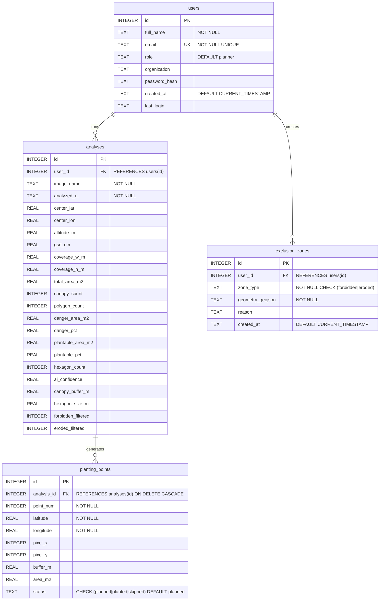

# MangroVision Database ERD

## Entity Relationship Diagram (Mermaid)

## Table Descriptions

| Table | Purpose | Records |
|-------|---------|---------|
| **users** | Tracks planner identity, organization, and last login time | 1 default ("MangroVision Planner") |
| **analyses** | Stores per-image analysis results and parameters | 1 per drone image analyzed |
| **planting_points** | GPS coordinates of recommended planting locations | ~3-50 per analysis |
| **exclusion_zones** | Forbidden/eroded areas stored as GeoJSON polygons | User-defined |

## Relationships

- **users -> analyses**: One user runs many analyses (1:N)
- **users -> exclusion_zones**: One user creates many exclusion zones (1:N)
- **analyses -> planting_points**: One analysis generates many planting points (1:N, CASCADE DELETE)

## Normalization

This schema follows **Third Normal Form (3NF)**:
- All attributes depend on the primary key (1NF)
- No partial dependencies on composite keys (2NF)
- No transitive dependencies between non-key attributes (3NF)
