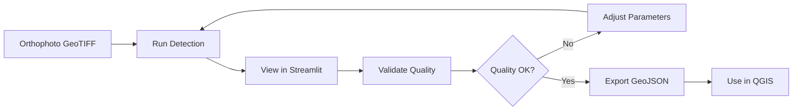

# 🌳 MangroVision - Samgeo Detectree2 Quick Start

**Accurate tree crown detection for mangroves using state-of-the-art AI**

---

## 🚀 Quick Start (3 Steps)

###  1️⃣ Install Dependencies

```powershell
# Install PyTorch (CPU version)
pip install torch torchvision --index-url https://download.pytorch.org/whl/cpu

# Install Detectron2
pip install git+https://github.com/facebookresearch/detectron2.git

# Install Samgeo (includes detectree2 wrapper)
pip install segment-geospatial

# Install other requirements
pip install -r requirements.txt
```

**Verify installation:**
```powershell
python canopy_detection/test_samgeo_detectree2.py
```

---

### 2️⃣ Download Pre-trained Model

**Option A:** Download manually
1. Visit: https://zenodo.org/record/7123579
2. Download: `230103_randresize_full.pth`
3. Save to: `MangroVision/models/230103_randresize_full.pth`

**Option B:** Use download script (if available)
```powershell
python canopy_detection/download_models.py
```

---

### 3️⃣ Run Detection

**On your orthophoto:**
```powershell
python canopy_detection/samgeo_ortho_detector.py \
    --input MAP/odm_orthophoto/odm_orthophoto.tif \
    --output output_geojson/detected_crowns.geojson \
    --tile-width 100 \
    --tile-height 100 \
    --confidence 0.5
```

**View results in Streamlit:**
```powershell
streamlit run app.py
```
Then select: **🗺️ View Orthophoto Tree Crown Detection**

---

## 📋 Command Reference

### Basic Detection
```powershell
# Default settings (recommended for most users)
python canopy_detection/samgeo_ortho_detector.py
```

### Custom Parameters
```powershell
python canopy_detection/samgeo_ortho_detector.py \
    --input your_orthophoto.tif \
    --output results.geojson \
    --tile-width 100 \          # Tile size (px) for inference
    --tile-height 100 \          # Smaller = slower but more accurate
    --min-area 0.5 \              # Minimum crown area (m²)
    --confidence 0.5 \           # Detection confidence (0-1)
    --device cpu                 # Use 'cuda' if you have GPU
```

### Validate Results
```powershell
python canopy_detection/validation_metrics.py \
    --input output_geojson/detected_crowns.geojson \
    --min-area 0.5 \
    --max-area 50.0
```

---

## 🔧 Parameter Tuning Guide

### Tile Size (`--tile-width`, `--tile-height`)
- **Larger tiles (200-400px)**: Faster, may miss small trees
- **Medium tiles (100-150px)**: Balanced (recommended)
- **Smaller tiles (50-80px)**: Slower, detects smaller crowns

### Confidence (`--confidence`)
- **High (0.7-0.9)**: Fewer detections, high precision, may miss some trees
- **Medium (0.5-0.6)**: Balanced (recommended)
- **Low (0.3-0.4)**: More detections, may include false positives

### Minimum Area (`--min-area`)
- **Large (2-5 m²)**: Only mature trees
- **Medium (0.5-1 m²)**: Most trees (recommended for mangroves)
- **Small (0.1-0.3 m²)**: Include young trees, may have noise

---

## 📊 Understanding Results

### GeoJSON Output
Each detected crown includes:
```json
{
    "type": "Feature",
    "geometry": {
        "type": "Polygon",
        "coordinates": [[[lon, lat], ...]]
    },
    "properties": {
        "area": 12.5,      // Crown area in m²
        "confidence": 0.85  // Detection confidence
    }
}
```

### Quality Metrics

**Good Detection:**
- ✅ Valid size percent > 70%
- ✅ Commission rate < 10%
- ✅ Mean crown area: 2-15 m² (for mangroves)

**Needs Improvement:**
- ⚠️ Valid size percent < 50%
- ⚠️ Commission rate > 20%
- ⚠️ Many detections > 50 m² (likely false positives)

---

## 🎯 Typical Workflow



1. **Run detection** with default parameters
2. **View results** in Streamlit map viewer
3. **Validate quality** using validation metrics
4. **Adjust parameters** if needed (confidence, min area)
5. **Re-run** until quality is satisfactory
6. **Export GeoJSON** for use in QGIS or other GIS tools

---

## 🔍 Troubleshooting

### "No module named 'samgeo'"
```powershell
pip install segment-geospatial
```

### "Model file not found"
Download `230103_randresize_full.pth` from Zenodo:
https://zenodo.org/record/7123579

### "CUDA out of memory"
Use CPU or reduce tile size:
```powershell
python canopy_detection/samgeo_ortho_detector.py --device cpu --tile-width 50
```

### "No trees detected"
Try lower confidence and minimum area:
```powershell
python canopy_detection/samgeo_ortho_detector.py --confidence 0.3 --min-area 0.1
```

### "Too many false positives"
Increase confidence and minimum area:
```powershell
python canopy_detection/samgeo_ortho_detector.py --confidence 0.7 --min-area 1.0
```

---

## 📚 Files Created

```
MangroVision/
├── INSTALL_SAMGEO_DETECTREE2.md         ← Complete installation guide
├── SAMGEO_DETECTREE2_QUICKSTART.md      ← This file
├── requirements.txt                      ← Updated with samgeo
├── app.py                                ← Updated with GeoJSON viewer
├── canopy_detection/
│   ├── detectree2_detector.py            ← Added samgeo methods
│   ├── samgeo_ortho_detector.py          ← NEW: Main detection script
│   ├── validation_metrics.py             ← NEW: Quality validation
│   └── test_samgeo_detectree2.py         ← NEW: Installation test
└── output_geojson/
    └── detected_crowns.geojson           ← Detection output (created after run)
```

---

## 🎓 Next Steps

1. ✅ **Test installation**: `python canopy_detection/test_samgeo_detectree2.py`
2. ✅ **Run first detection**: `python canopy_detection/samgeo_ortho_detector.py`
3. ✅ **View results**: `streamlit run app.py` → Select "View Orthophoto Detection"
4. ✅ **Validate quality**: `python canopy_detection/validation_metrics.py`
5. ✅ **Adjust & re-run**: Tune parameters based on validation results
6. ✅ **Export to QGIS**: Load GeoJSON in QGIS for final mapping

---

## 💬 Need Help?

- **Installation issues**: See `INSTALL_SAMGEO_DETECTREE2.md`
- **Parameter tuning**: See "Parameter Tuning Guide" above
- **Quality problems**: Run validation and adjust based on metrics
- **Detectree2 paper**: https://besjournals.onlinelibrary.wiley.com/doi/full/10.1111/2041-210X.13901

Happy tree detecting! 🌳🌿
